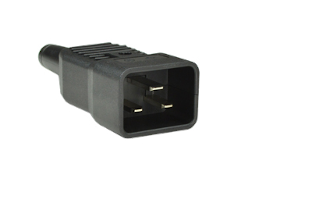

### Services

Colocation service consists of data center space, internet
connectivity, power and all necessary infrastructure in secure
facilities.  Customers have remote access to their servers via VPN, as well as physical site access for installation and maintenance of their servers, at no extra cost. 

### Colocation prices

Colocation is priced at a flat rate per server month. Any infrastructure downtime will be fully credited on a pro-rated basis on the monthly fee, i.e. 1% downtime results in 1% credit on the monthly fee.

|    number   of servers  |  price   USD/server/month |
|  -----------------: | ----------: |
|   144               | $128        |
|   288               | $116        | 
|   1152               | $109	      | 
{:.custom-table}

 

### One-time fees

 <ul>
    <li> Transportation and handling from cargo terminal to data center: $5 per server</li>
    <li> Deployment; $5 per server (up to and including remote access via VPN)</li>
    <li> Firmware update, configuration, testing: $5 per server (optional)</li>
    <li> Customs clearing: flat $70 per shipment</li>
    <li> Customs taxes and duties: 3% social welfare tax on assessed value. Other taxes and duties may apply.</li> 
    </ul>

If customer can perform any of the above steps, corresponding fees will not be charged.

 

### Requirements
  
#### Dimensions
  
|  | max (mm)|
| ------: | ------: |
| Width   | 430   |
| Length  | 195   | 
| Height  | 292   |
{:.custom-table}

#### Condition
New. Ethiopian government regulations prohibit import of used ASIC mining rigs at this time.
#### Network
Single Ethernet RJ-45 port per server
#### Power
Single phase 240V, max 16A, per server. Customer servers must have a power cord with single C20 plug.
 

  
 

For non-standard sizes, power and number of servers, please contact us: info@qrb-labs.com.

### Hands & eyes
We also provide optional "hands & eyes" services, whereby our technicians will do on-site repairs, upgrades, handling etc.  on demand for the customer, at **$30/hour**.

### Service agreement

See [Server Colocation Agreement](QRB Colocation Agreement.pdf).
