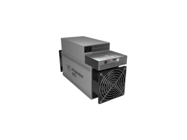
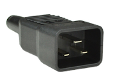

### Services

Colocation service consists of data center space, internet
connectivity, power and all necessary infrastructure in secure
facilities.  Customers have remote access to their servers via VPN, as well as physical site access for installation and maintenance of their servers, at no extra cost. 

### Colocation prices (Ethiopia)

Colocation is priced at a flat rate per server per month. Any infrastructure downtime will be fully credited on a pro-rated basis on the monthly fee, i.e. 1% downtime results in 1% credit on the monthly fee. All prices are in USD.

|    Number   of servers  |  Price   per server per month |
|  -----------------: | ----------: |
|   144               | $147        |
|   288               | $142     | 
|   1152               | $138	      | 
{:.custom-table}

Please note prices are updated for December 2025, in response to energy price increases from the power company. There will be further updates in July 2026 and July 2027.
 

### One-time fees

 <ul>
    <li> Transportation and handling from cargo terminal to data center: $5 per server</li>
    <li> Deployment: $5 per server (up to and including remote access via VPN)</li>
    <li> Firmware update, configuration, testing: $5 per server (optional)</li>
    <li> Customs clearing: flat $70 per shipment</li>
    <li> Customs taxes and duties: 3% social welfare tax on assessed value. Other taxes and duties may apply.</li> 
    </ul>

If customer can perform any of the above steps, corresponding fees will not be charged.

### Hands & eyes

We also provide optional "hands & eyes" services, whereby our technicians will do on-site repairs, upgrades, handling etc.  upon request, at **$30/hour**.

 

### Requirements
  
#### Dimensions

  
|         | max (mm)|
| ------: | ------: |
| Length  | 430   |
| Width   | 195   | 
| Height  | 292   |
{:.custom-table}

 

#### Condition
New. Ethiopian government regulations prohibit import of used ASIC mining rigs at this time.

#### Network

Single Ethernet RJ-45 port per server. We will provide the necessary patch cable to plug the customer server into our switches.

#### Power

| Parameter | Specification   (per server)|
| ------: | ------: |
| Voltage  | 240V single phase   |
| Current   | max 15.7A | 
| Power  | max **3.5kW** monthly average  |
| Outlet | max 1 C20 plug   customer supplies power cord|
{:.custom-table}

 

For non-standard sizes, power and number of servers, please contact us: info@qrb-labs.com.

### Service agreement

See [Server Colocation Agreement](QRB Colocation Agreement.pdf).
