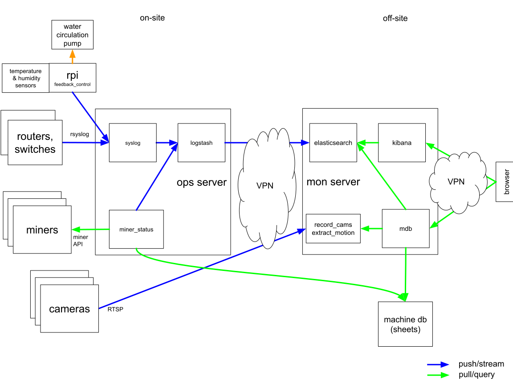
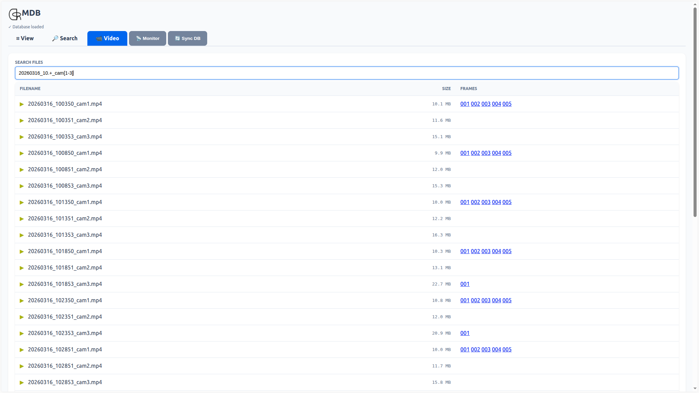
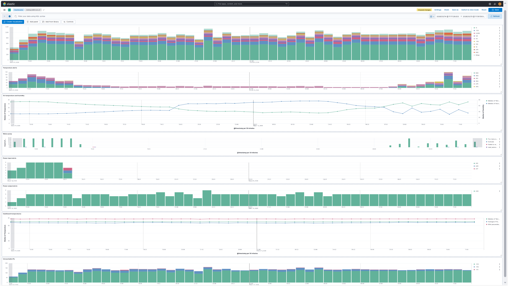
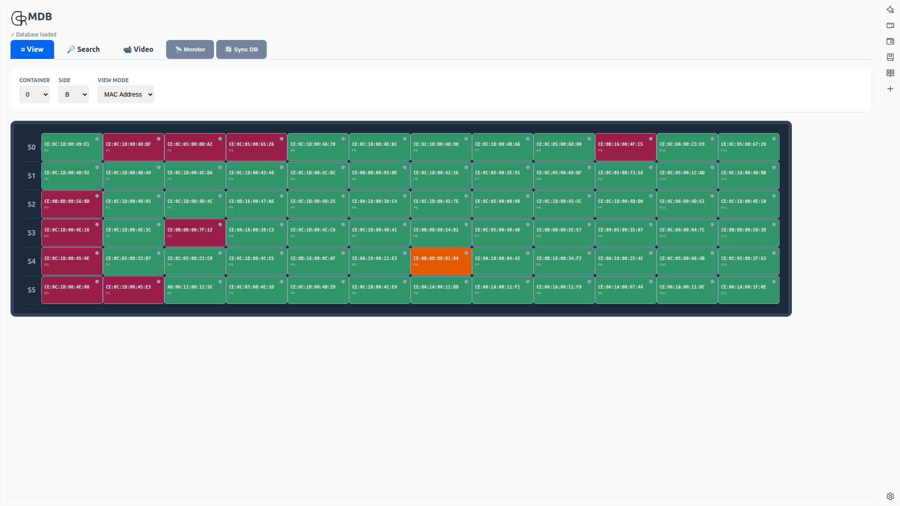

### MDB

MDB is QRB Labs minimalist open source mining monitoring and management software, built on top of ggthe ELK stack.

Features:

- ultra lightweight machine database in Google sheets
- tools to monitor and control miners via miner API
- environment monitoring via temperature and himidity sensors
- network video recording and analysis for security cameras
- automated feedback control of water circulation in water curtains
- dashboard and search engine for history and real-time analysis
- rack visualization integrated with real-time status monitoring

  

    
    
<strong>Video Search & Analysis:</strong> Quickly find and review footage from your security cameras.

  

  

    
    
<strong>ELK Stack Dashboard:</strong> Monitor your mining operations with comprehensive real-time data visualization.

  

  

    
    
<strong>Rack Visualization:</strong> See the real-time status and health of your mining racks at a glance.

  

